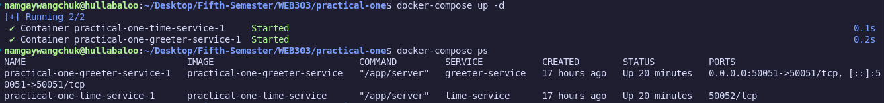

# Practical: gRPC Microservices with Docker

This practical demonstrates the implementation of two communicating microservices using gRPC, containerized with Docker, and orchestrated with Docker Compose.

## Overview

This project showcases:
- gRPC-based inter-service communication
- Microservices architecture with Docker containerization
- Service orchestration using Docker Compose
- Protocol Buffer definitions for type-safe communication

## Screenshots

### 1. grpcurl Command Execution
Successful gRPC service call showing personalized greeting with current timestamp:

### 2. Docker Compose Services
Both microservices running successfully in Docker containers:

### 3. Service Communication Logs
Real-time logs showing inter-service communication between greeter and time services:

## 🔗 Source Code

View the complete implementation: [**gRPC Microservices Repository**](https://github.com/Namgay282004/gRPC-microservices)

---
*This practical demonstrates complete microservices architecture from service definition to containerized deployment with inter-service communication.*
