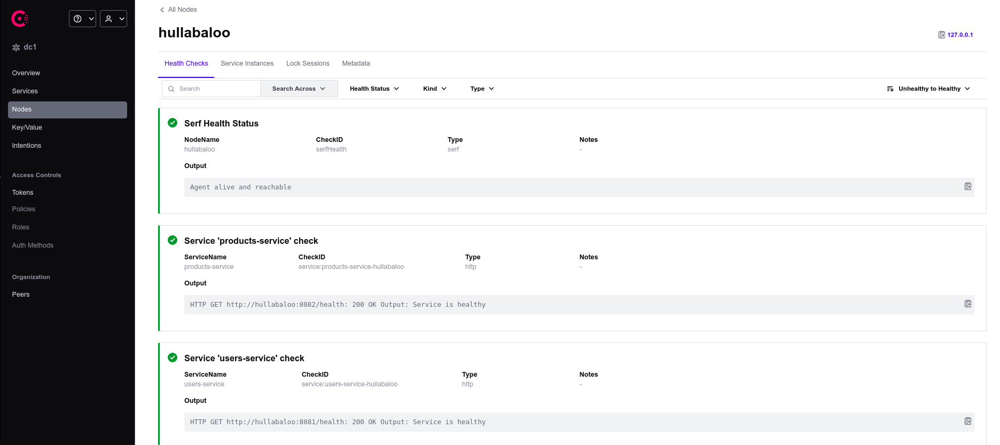
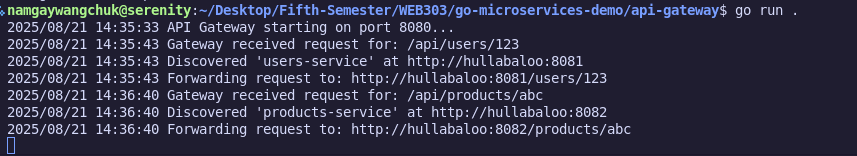

## Practical 2: API Gateway with Service Discovery

1. Screenshot of the Consul UI showing both services registered and healthy.

2. Screenshot of postman cURL making both requests

3. Screenshot of the API-GATEWAY terminal displaying that the request has been received successfully and routed to the relevant services

## Repository Link for the [CODE](https://github.com/Namgay282004/API_Gateway)