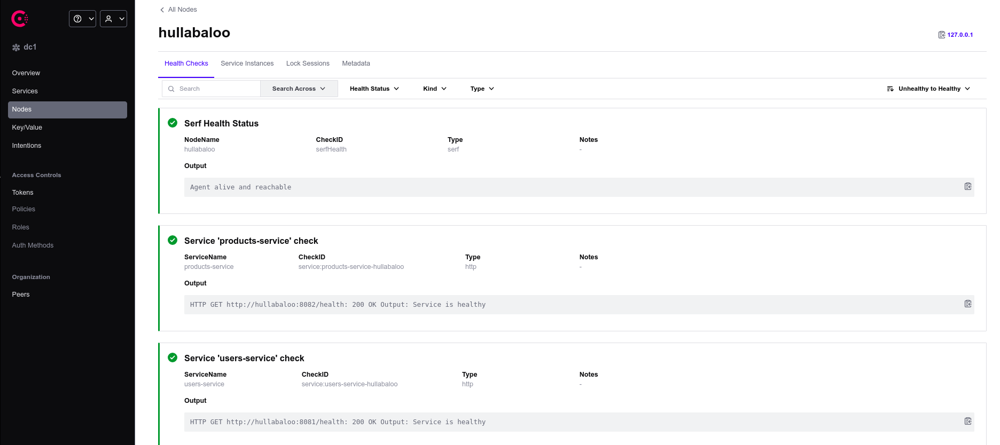
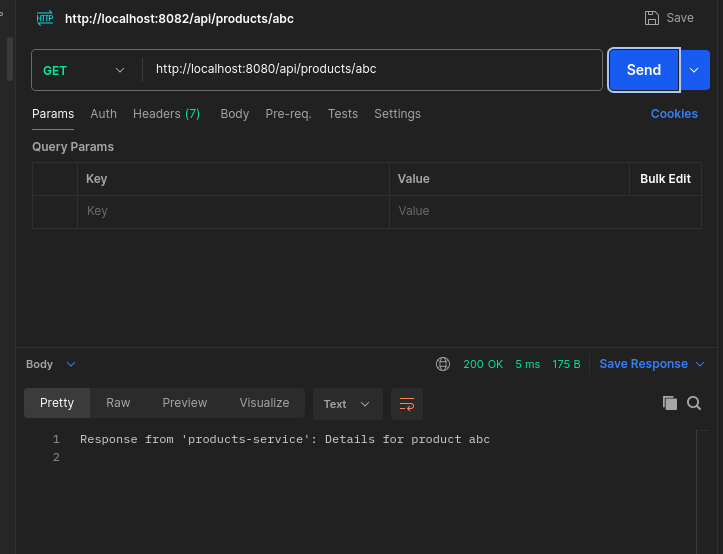
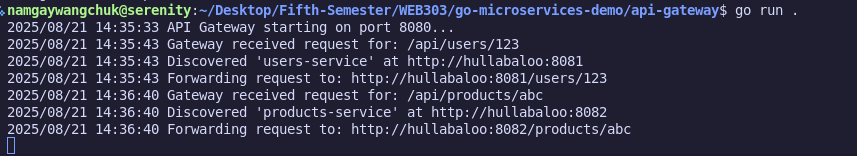

#  Practical 2: API Gateway with Service Discovery

This practical demonstrates the implementation of an API Gateway with Service Discovery using Consul for service registration and health monitoring.

---

##  Implementation Evidence

### 1.  Consul UI - Service Registration & Health Status

The Consul UI displaying both services registered and healthy, confirming successful service discovery setup.

---

### 2.  API Testing with Postman

Postman cURL requests demonstrating successful communication with both services through the API Gateway.

---

### 3. API Gateway Terminal Logs

API Gateway terminal output showing successful request routing to the relevant microservices.

---

## 🔗 Source Code Repository

 **Complete implementation available at:** [**API Gateway Project**](https://github.com/Namgay282004/API_Gateway)

---

##  Technologies Used

- **Consul** - Service Discovery & Health Monitoring
- **API Gateway** - Request Routing & Load Balancing
- **Microservices Architecture**
- **RESTful APIs**

---

*Assignment completed as part of WEB303 - Fifth Semester*