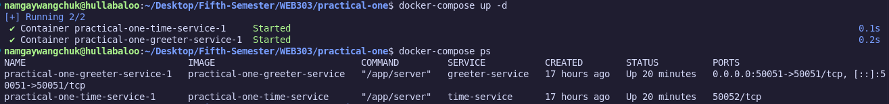
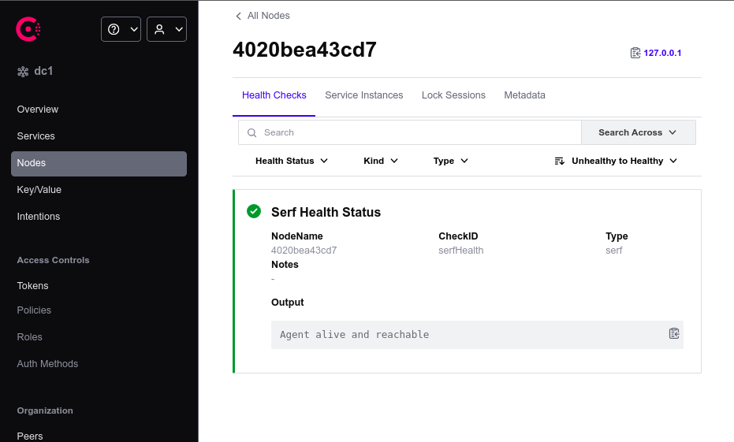
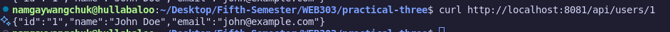
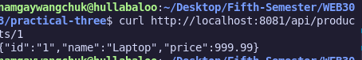
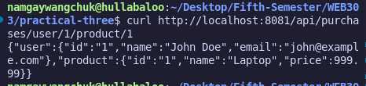

# Practical 3: Microservices Architecture with gRPC & Service Discovery

This practical implements a complete microservices architecture using gRPC, Consul service discovery, PostgreSQL databases, and Docker containerization.

---

## Implementation Screenshots

### 1. Docker Services - All Running

### 2. Consul Service Discovery

### 3. API Testing - CRUD Operations

### 4. Service Logs - gRPC Communication

---

## Architecture Overview

- **API Gateway** (Port 8081) - HTTP to gRPC routing
- **Users Service** (Port 50051) - User management + PostgreSQL
- **Products Service** (Port 50052) - Product catalog + PostgreSQL  
- **Consul** (Port 8500) - Service discovery & health monitoring

### API Endpoints:
- `POST/GET /api/users` - User operations

    

- `POST/GET /api/products` - Product operations

    

- `GET /api/purchase-data` - Cross-service communication

    

---

## Key Features

**gRPC Communication** - High-performance inter-service calls  
**Service Discovery** - Automatic registration with Consul  
**Database Per Service** - Microservices isolation pattern  
**Docker Containerization** - Complete containerized deployment  
**Health Monitoring** - Real-time service health checks  

---

## Technologies Used

- **Go 1.24.6** - Backend services
- **gRPC & Protocol Buffers** - Service communication
- **GORM + PostgreSQL** - Database layer
- **Consul** - Service discovery
- **Docker Compose** - Container orchestration

---

## 🔗 Source Code Repository

**Complete implementation:** [**Microservices Project**](https://github.com/Namgay282004/practical3-grpc)