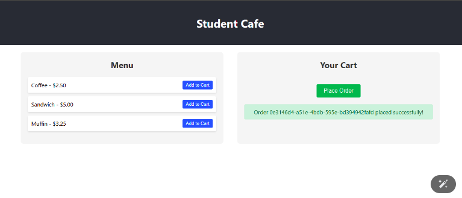
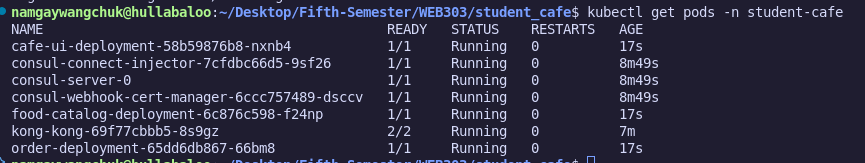
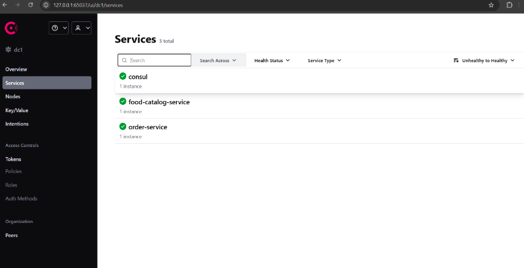

# Student Cafe Microservices – Practical 4 Report

## 1. Source Code
Repository: [Student Cafe Microservice Repository](https://github.com/Namgay282004/Student-cafe-microservice.git)

## 2. Summary
Multi-service application (React frontend, food-catalog-service, order-service) deployed on Kubernetes (Minikube) with Consul for discovery and Kong as API Gateway. Order placement fixed by correcting Consul service registration addresses and rebuilding images inside Minikube.

## 3. Architecture
- React UI → Kong Ingress → Services
- Kong routes:
  - `/api/catalog` → food-catalog-service (8080)
  - `/api/orders` → order-service (8081)
  - `/` → cafe-ui (80)
- Consul used for service discovery inside cluster.

## 4. Components
| Component | Tech | Purpose |
|-----------|------|---------|
| cafe-ui | React + Nginx | User interface |
| food-catalog-service | Go (Chi) | Provides menu items |
| order-service | Go (Chi) | Accepts orders (in‑memory) |
| Consul | Helm chart | Service discovery |
| Kong | Helm chart | API gateway / ingress |
| Kubernetes | Minikube | Orchestration |

## 5. Key Fix Implemented
Issue: Order submission failed (service discovery resolution inconsistent).  
Fix: Set `registration.Address` to Kubernetes service DNS names (`food-catalog-service`, `order-service`) and removed unused imports. Rebuilt images inside Minikube Docker daemon and updated deployments.

## 6. Deployment Steps Executed

### Phase 1: Cluster & Docker Env
```bash
minikube start --cpus 2 --memory 4096
eval $(minikube -p minikube docker-env)
```

### Phase 2: Infrastructure (Helm)
```bash
helm repo add hashicorp https://helm.releases.hashicorp.com
helm repo add kong https://charts.konghq.com
helm install consul hashicorp/consul --set global.name=consul --namespace student-cafe --set server.replicas=1 --set server.bootstrapExpect=1
helm install kong kong/kong --namespace student-cafe
```

### Phase 3: Build Application Images
```bash
docker build -t food-catalog-service:v1 ./food-catalog-service
docker build -t order-service:v1 ./order-service
docker build -t cafe-ui:v1 ./cafe-ui
```

### Phase 4: Deploy Manifests
```bash
kubectl apply -f app-deployment.yaml
kubectl apply -f kong-ingress.yaml
```

### Phase 5: Post-Fix Rebuild & Rollout
```bash
docker build -t food-catalog-service:v2 ./food-catalog-service
docker build -t order-service:v2 ./order-service
kubectl set image deployment/food-catalog-deployment food-catalog-service=food-catalog-service:v2 -n student-cafe
kubectl set image deployment/order-deployment order-service=order-service:v2 -n student-cafe
```

## 7. Verification
Catalog endpoint:
```bash
curl http://localhost:8888/api/catalog/items
```
Order endpoint:
```bash
curl -X POST http://localhost:8888/api/orders/orders \
  -H "Content-Type: application/json" \
  -d '{"item_ids":["1","2"]}'
```
Expected response:
```json
{"id":"<uuid>","item_ids":["1","2"],"status":"received"}
```
Pods:
```bash
kubectl get pods -n student-cafe
```
Ingress:
```bash
kubectl describe ingress cafe-ingress -n student-cafe
```

## 8. Screenshots
 
1. Successful order – `Food menu and successful order placement.` 
  

2.  Kubernetes Pods – `Output of kubectl get pods -n student-cafe`  
  

3. Kong Gateway – `Output of minikube service -n student-cafe kong-kong-proxy --url.`
  

4. Services Overview – `Output of kubectl get services -n student-cafe.` 
  

## 9. Delivered Files
- `food-catalog-service/`
- `order-service/`
- `cafe-ui/`
- `app-deployment.yaml`
- `kong-ingress.yaml`
- `REPORT.md`

