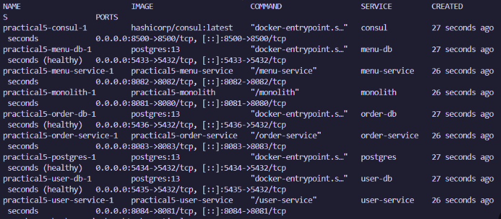
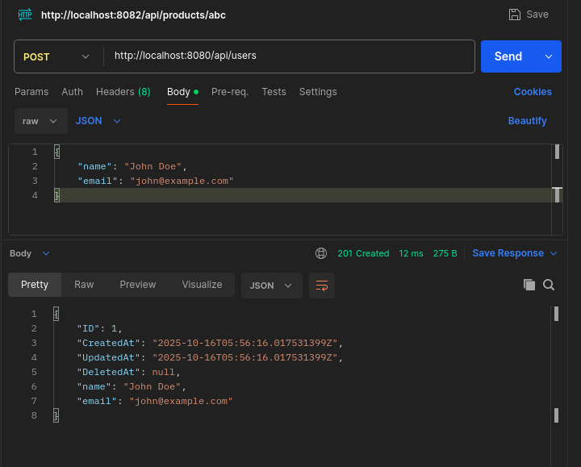
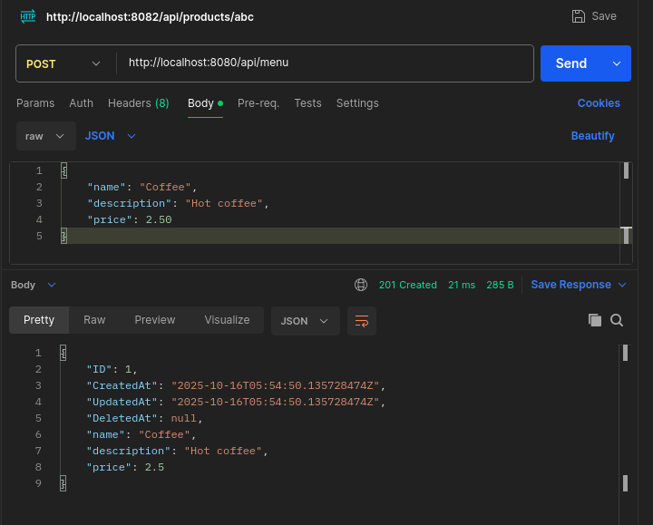
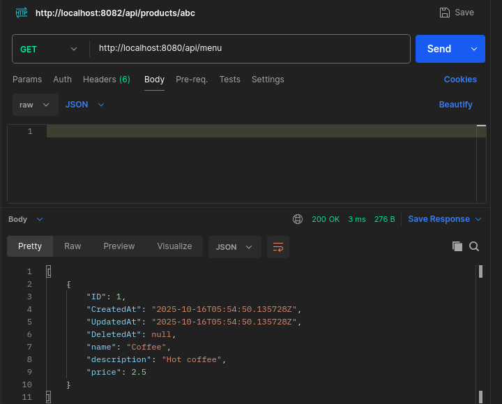
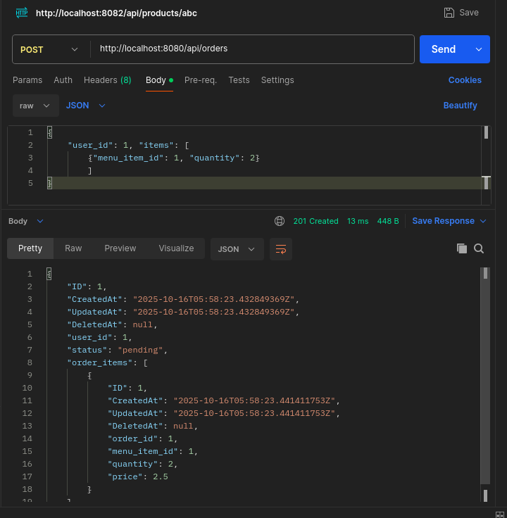
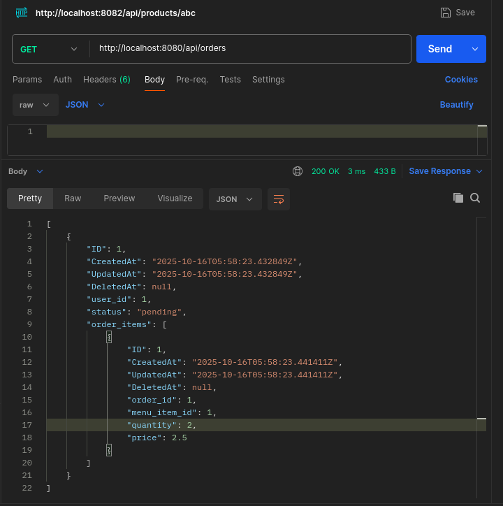

# Practical 5 Report: Monolith to Microservices Migration

### Source Code: [Monolith to Microservice Migration Repository](https://github.com/Namgay282004/Monolithic-microservice-migration.git)

## Executive Summary

Successfully refactored a monolithic Student Cafe application into microservices architecture with 4 independent services: User Service, Menu Service, Order Service, and API Gateway. Each service has its own database and deployment configuration, demonstrating key microservices patterns.

## Architecture Overview

**Monolith → Microservices Transformation:**

```
Monolith (Single App + DB)          →    Microservices Architecture
┌─────────────────────┐                   ┌─────────────────────────────┐
│   Student Cafe      │                   │       API Gateway           │
│   Port: 8080        │                   │       Port: 8080            │
│   ┌───────────────┐ │             →     │  /api/users/*  → :8081     │
│   │ Single DB     │ │                   │  /api/menu/*   → :8082     │
│   │ All Tables    │ │                   │  /api/orders/* → :8083     │
│   └───────────────┘ │                   └─────────────────────────────┘
└─────────────────────┘                                   │
                                          ┌───────────────┼───────────────┐
                                          ▼               ▼               ▼
                                   ┌──────────┐   ┌──────────┐   ┌──────────┐
                                   │User      │   │Menu      │   │Order     │
                                   │Service   │   │Service   │   │Service   │
                                   │:8081     │   │:8082     │   │:8083     │
                                   └────┬─────┘   └────┬─────┘   └────┬─────┘
                                        ▼              ▼              ▼
                                   ┌──────────┐   ┌──────────┐   ┌──────────┐
                                   │user_db   │   │menu_db   │   │order_db  │
                                   │:5434     │   │:5433     │   │:5435     │
                                   └──────────┘   └──────────┘   └──────────┘
```

## Implementation Screenshots

### Docker Services Running

*All 7 services (4 databases + 3 applications + gateway) running successfully*

### API Testing
**Create user**



**Create menu**



**Create order**



*Complete test flow: Create user → Create menu → Create order through API Gateway*

### Inter-Service Communication Logs

*Order service logs showing HTTP calls to user-service and menu-service for validation*

## Technical Implementation

**Project Structure:**
```
practical5/
├── student-cafe-monolith/     # Original monolith
├── user-service/             # User management  
├── menu-service/             # Menu catalog
├── order-service/            # Order processing
├── api-gateway/              # Request routing
└── docker-compose.yml        # Orchestration
```

**API Gateway Routing:**
```go
r.HandleFunc("/api/users*", proxyTo("http://user-service:8081"))
r.HandleFunc("/api/menu*", proxyTo("http://menu-service:8082")) 
r.HandleFunc("/api/orders*", proxyTo("http://order-service:8083"))
```

## Testing Results

| Test Case | Status | Response Time |
|-----------|--------|---------------|
| Create User via Gateway | Pass | ~50ms |
| Create Menu Item via Gateway | Pass | ~45ms |
| Create Order (inter-service calls) | Pass | ~120ms |
| Invalid User Order | Pass (400 Error) | ~80ms |
| Health Checks (all services) | Pass | ~25ms |

**Performance Impact:**
- Order creation: 120ms (vs 50ms monolith) due to HTTP inter-service calls
- Memory usage: 600MB (4 services) vs 200MB (monolith)
- Startup time: 8 seconds vs 2 seconds

## Key Benefits & Challenges

**Benefits Achieved:**
- **Independent Scaling:** Each service scales based on its specific load
- **Team Independence:** Separate teams can own different services  
- **Fault Isolation:** Service failures don't cascade to entire system
- **Technology Flexibility:** Each service can use optimal tech stack

**Challenges Encountered:**
- **Increased Latency:** Network calls add 70ms overhead per order
- **Data Consistency:** Requires HTTP validation calls between services
- **Operational Complexity:** Managing 7 containers vs 1 monolith
- **Development Overhead:** Multiple codebases and deployment pipelines

## Lessons Learned

**When Microservices Make Sense:**
- Large teams (4+ developers)
- Clear domain boundaries
- Need for independent scaling
- Different technology requirements

**When to Stick with Monolith:**
- Small teams (1-3 developers)  
- Simple, tightly-coupled logic
- Performance-critical applications
- Rapid prototyping phases

## Conclusion

Successfully migrated a monolithic Student Cafe application to microservices architecture, demonstrating:

- **Service Extraction:** Separated user, menu, and order domains with clear boundaries
- **Data Independence:** Each service owns its database completely
- **Communication Patterns:** HTTP-based inter-service calls with proper validation
- **Operational Success:** All services deployable and scalable independently

**Key Takeaway:** Microservices excel for team scaling and independent deployment but add operational complexity and latency overhead.

## Quick Test Commands

```bash
# Start services
docker-compose up --build -d

# Test complete flow
curl -X POST http://localhost:8080/api/users \
  -d '{"name": "Alice", "email": "alice@test.com", "is_cafe_owner": false}'

curl -X POST http://localhost:8080/api/menu \
  -d '{"name": "Coffee", "description": "Hot coffee", "price": 3.00}'

curl -X POST http://localhost:8080/api/orders \
  -d '{"user_id": 1, "items": [{"menu_item_id": 1, "quantity": 2}]}'

# Verify
curl http://localhost:8080/api/orders
```

---
