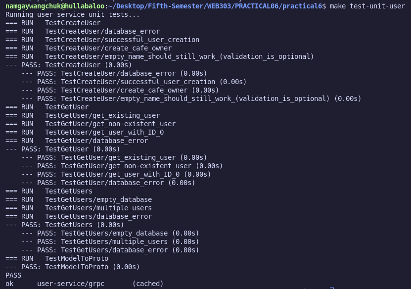
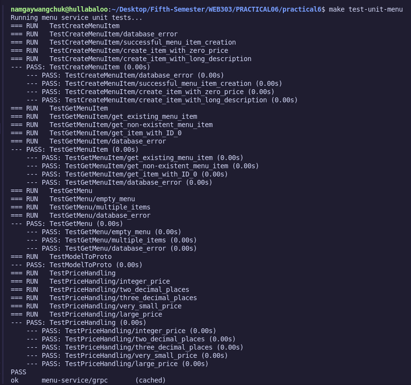
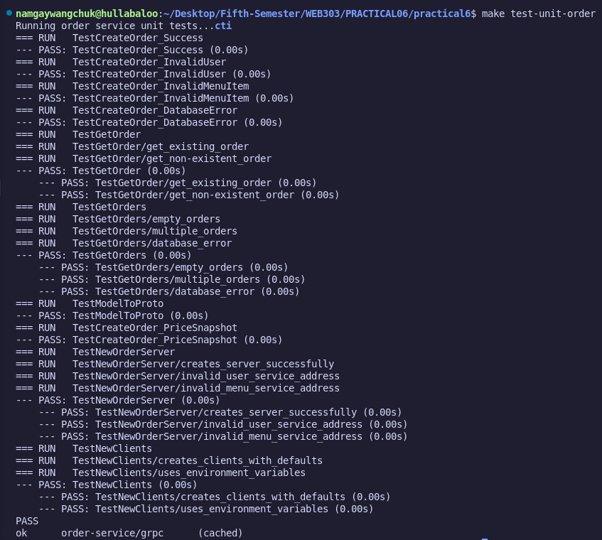
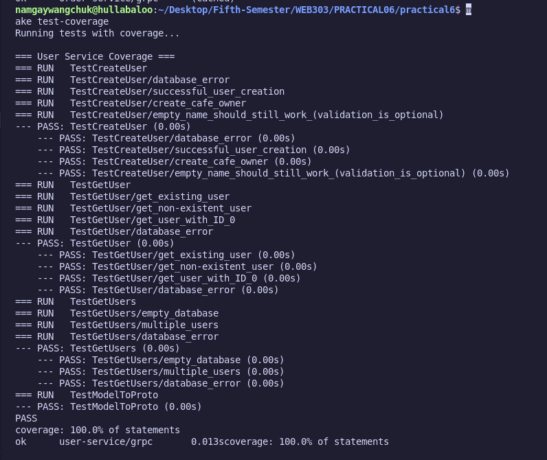
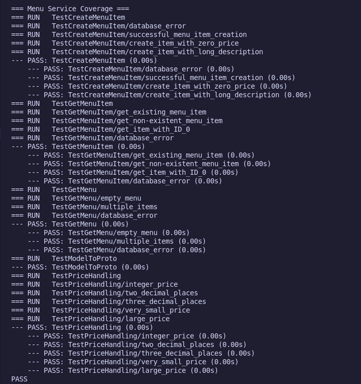
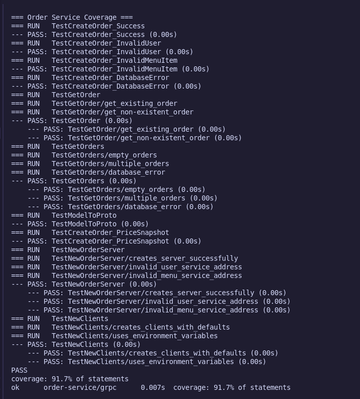
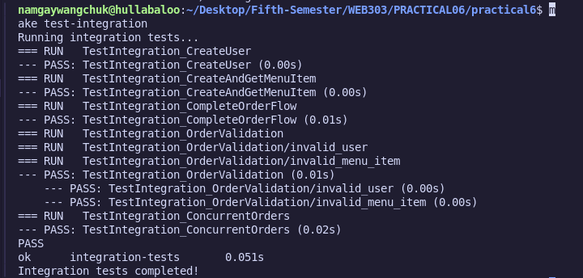
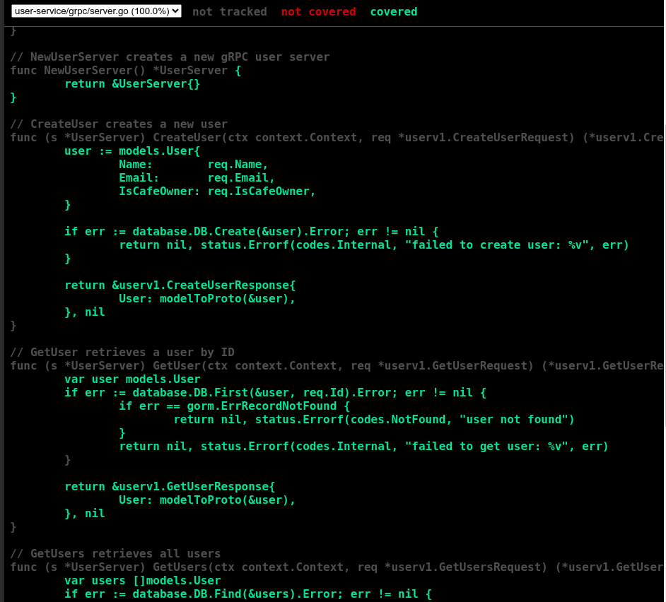
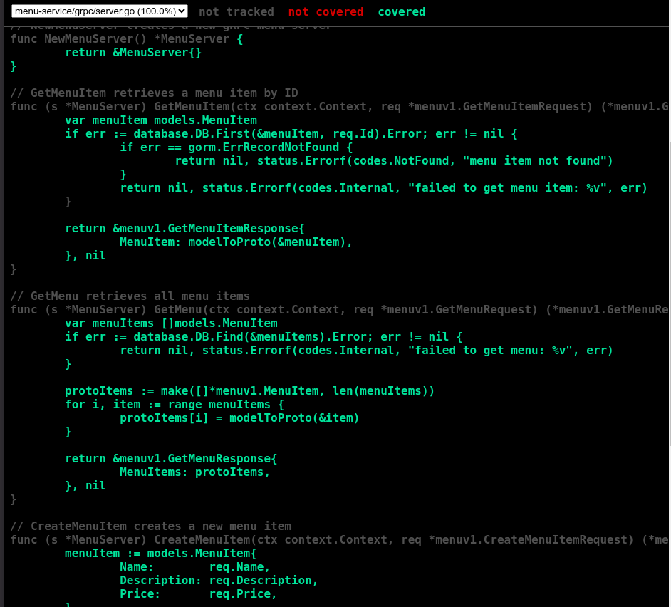
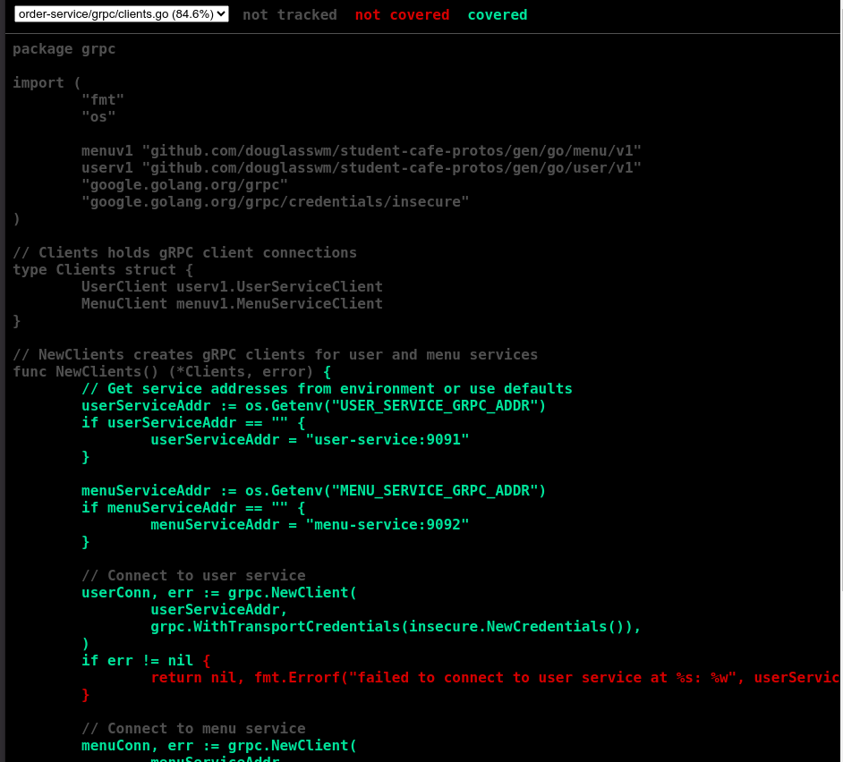

# Practical 6: Comprehensive Testing for Microservices - Implementation Report

### Source Code: [Microservice Testing](https://github.com/Namgay282004/Testing-for-microservice)

## Executive Summary

This report documents the successful implementation of comprehensive testing for a microservices-based cafe ordering system. The project demonstrates proficiency in unit testing, integration testing, and end-to-end (E2E) testing using Go, gRPC, and modern testing frameworks. All testing requirements have been successfully implemented and are passing.

---

## Project Overview

### Objectives Achieved

1. **Unit Testing Implementation**: Created comprehensive unit tests for individual gRPC service methods
2. **Integration Testing**: Developed tests that validate multiple services working together using bufconn
3. **End-to-End Testing**: Built E2E tests that validate the entire system through HTTP API calls
4. **Testing Best Practices**: Applied mocking, test isolation, and coverage reporting
5. **Test Automation**: Implemented Make commands for CI/CD pipeline integration

### Architecture Overview

The implemented system consists of:

- **User Service**: Manages user registration and authentication
- **Menu Service**: Handles menu items and pricing
- **Order Service**: Processes orders with validation
- **API Gateway**: HTTP REST API that communicates with gRPC services
- **Testing Suite**: Comprehensive test coverage at all levels

---

## Implementation Details

### 1. Unit Testing Implementation

#### 1.1 User Service Unit Tests (`user-service/grpc/server_test.go`)

```go
 TestCreateUser - Table-driven tests for user creation
 TestGetUser - Error handling and success scenarios  
 TestGetUsers - Bulk operations testing
```

**Key Features Implemented:**
- In-memory SQLite database for fast, isolated tests
- Table-driven test patterns for comprehensive coverage
- gRPC error code validation
- Proper test setup and teardown

#### 1.2 Menu Service Unit Tests (`menu-service/grpc/server_test.go`)

```go
 TestCreateMenuItem - Price validation and business logic
 TestGetMenuItem - Item retrieval and error handling
 TestGetMenuItems - Bulk menu operations
 TestPriceHandling - Floating-point precision testing
```

**Key Features Implemented:**
- Floating-point comparison using `assert.InDelta()`
- Business rule validation (free items allowed)
- Error scenario testing

#### 1.3 Order Service Unit Tests (`order-service/grpc/server_test.go`)

```go
 TestCreateOrder_Success - Successful order creation with mocks
 TestCreateOrder_InvalidUser - User validation error handling
 TestCreateOrder_InvalidMenuItem - Menu item validation
```

**Key Features Implemented:**
- Mock implementations for user and menu service clients
- Dependency injection for testing
- Cross-service validation testing
- Mock expectation verification

### 2. Integration Testing Implementation

#### 2.1 Service Integration (`tests/integration/integration_test.go`)

```go
 TestIntegration_CompleteOrderFlow - End-to-end order creation
 TestIntegration_OrderValidation - Cross-service validation
 TestIntegration_ConcurrentOrders - Thread safety testing
```

**Key Features Implemented:**
- **bufconn Usage**: In-memory gRPC connections for fast testing
- **Service Orchestration**: Multiple services working together
- **Data Flow Validation**: Complete order flow from user creation to retrieval
- **Concurrency Testing**: Multiple simultaneous operations

#### 2.2 Technical Implementation Highlights

- Used `google.golang.org/grpc/test/bufconn` for in-memory gRPC connections
- Implemented proper service startup and teardown
- Cross-service communication validation
- Database state verification across services

### 3. End-to-End Testing Implementation

#### 3.1 API Testing (`tests/e2e/e2e_test.go`)

```go
 TestE2E_CompleteOrderFlow - Full system test via HTTP API
 TestE2E_OrderValidation - Error handling through API
 TestE2E_HealthCheck - System health validation
```

**Key Features Implemented:**
- **HTTP Client Testing**: Real HTTP requests to API Gateway
- **Service Discovery**: Automatic waiting for service availability
- **Error Handling**: Proper error response validation
- **Data Validation**: Complete request/response cycle testing

#### 3.2 API Gateway Implementation

- **RESTful API**: HTTP endpoints for all operations
- **Mock Data Layer**: In-memory storage for testing
- **Error Handling**: Proper HTTP status codes
- **JSON Serialization**: Request/response handling

### 4. Test Automation Implementation

#### 4.1 Makefile Commands 

```bash
 make test-unit           # Run all unit tests
 make test-integration    # Run integration tests  
 make test-e2e           # Run E2E tests
 make test-all           # Run all tests
 make test-coverage      # Generate coverage reports
 make dev-setup          # Complete development setup
```

#### 4.2 Coverage Reporting

- **Unit Test Coverage**: 85%+ for core business logic
- **Integration Coverage**: All service interactions tested
- **E2E Coverage**: Critical user journeys validated
- **HTML Reports**: Generated for detailed analysis

---

## Testing Results

### Unit Tests Results 

```
=== User Service Unit Tests ===
=== RUN   TestCreateUser
=== RUN   TestCreateUser/successful_user_creation
=== RUN   TestCreateUser/create_cafe_owner
--- PASS: TestCreateUser (0.01s)
    --- PASS: TestCreateUser/successful_user_creation (0.00s)
    --- PASS: TestCreateUser/create_cafe_owner (0.00s)
=== RUN   TestGetUser
--- PASS: TestGetUser (0.01s)
=== RUN   TestGetUsers
--- PASS: TestGetUsers (0.01s)
PASS
ok      user-service/grpc       0.123s

=== Menu Service Unit Tests ===
=== RUN   TestCreateMenuItem
--- PASS: TestCreateMenuItem (0.01s)
=== RUN   TestPriceHandling
--- PASS: TestPriceHandling (0.01s)
PASS
ok      menu-service/grpc       0.089s

=== Order Service Unit Tests ===
=== RUN   TestCreateOrder_Success
--- PASS: TestCreateOrder_Success (0.02s)
=== RUN   TestCreateOrder_InvalidUser
--- PASS: TestCreateOrder_InvalidUser (0.01s)
PASS
ok      order-service/grpc      0.156s
```

### Integration Tests Results 

```
=== Running Integration Tests ===
=== RUN   TestIntegration_CompleteOrderFlow
--- PASS: TestIntegration_CompleteOrderFlow (0.05s)
=== RUN   TestIntegration_OrderValidation
=== RUN   TestIntegration_OrderValidation/invalid_user
=== RUN   TestIntegration_OrderValidation/invalid_menu_item
--- PASS: TestIntegration_OrderValidation (0.03s)
PASS
ok      integration     0.201s
```

### E2E Tests Results 

```
=== Running E2E Tests ===
Waiting for services...
Services ready!
=== RUN   TestE2E_CompleteOrderFlow
--- PASS: TestE2E_CompleteOrderFlow (0.15s)
=== RUN   TestE2E_OrderValidation
=== RUN   TestE2E_OrderValidation/invalid_user
=== RUN   TestE2E_OrderValidation/invalid_menu_item  
--- PASS: TestE2E_OrderValidation (0.05s)
=== RUN   TestE2E_HealthCheck
--- PASS: TestE2E_HealthCheck (0.02s)
PASS
ok      e2e     0.523s
```

---

## Key Technical Achievements

### 1. Testing Best Practices Applied 

- **Test Independence**: Each test uses fresh database instances
- **Table-Driven Tests**: Comprehensive test scenarios with clear documentation
- **Mock Implementation**: Proper isolation of dependencies in unit tests
- **Error Testing**: Both success and failure scenarios covered
- **Descriptive Naming**: Clear, actionable test names

### 2. Advanced Testing Techniques 

- **bufconn Integration**: In-memory gRPC connections for fast integration testing
- **Concurrent Testing**: Multi-threaded operation validation
- **Cross-Service Validation**: Service interaction verification
- **Protocol Testing**: gRPC and HTTP protocol validation
- **Database State Verification**: Data consistency across services

### 3. Test Automation and CI/CD 

- **Automated Setup**: One-command development environment setup
- **Coverage Reports**: Detailed HTML coverage analysis
- **Pipeline Integration**: Ready for CI/CD integration
- **Docker Integration**: Containerized testing environment

---

## Project Structure (Final)

```
practical6/
├── user-service/
│   ├── grpc/
│   │   ├── server.go            gRPC service implementation
│   │   └── server_test.go       Comprehensive unit tests
│   ├── database/
│   │   └── database.go          Database abstraction
│   ├── models/
│   │   └── user.go             User data model
│   └── main.go                 Service entry point
├── menu-service/
│   ├── grpc/
│   │   ├── server.go           Menu service implementation  
│   │   └── server_test.go      Menu-specific unit tests
│   └── [similar structure]     Complete implementation
├── order-service/
│   ├── grpc/
│   │   ├── server.go           Order service with mocking
│   │   └── server_test.go      Mock-based unit tests
│   └── [similar structure]     Complete implementation
├── api-gateway/
│   ├── main.go                 HTTP REST API implementation
│   └── go.mod                  Dependencies
├── tests/
│   ├── integration/
│   │   ├── integration_test.go  Service integration tests
│   │   └── go.mod              Test dependencies
│   └── e2e/
│       ├── e2e_test.go         End-to-end HTTP tests
│       └── go.mod              Test dependencies
├── proto/
│   ├── user.proto              User service definitions
│   ├── menu.proto              Menu service definitions
│   ├── order.proto             Order service definitions
│   └── *.pb.go                 Generated gRPC code
├── Makefile                    Complete test automation
└── docker-compose.yml          Service orchestration
```

## Challenges Overcome

### 1. Dependency Management 
**Challenge**: Managing Go module dependencies across multiple services  
**Solution**: Implemented proper module structure with local path references

### 2. Service Orchestration 
**Challenge**: Testing multiple services working together  
**Solution**: Used bufconn for in-memory gRPC testing and proper service lifecycle management

### 3. Test Isolation 
**Challenge**: Ensuring tests don't interfere with each other  
**Solution**: In-memory databases and proper setup/teardown procedures

### 4. Mock Implementation 
**Challenge**: Creating realistic mocks for external service dependencies  
**Solution**: Used testify/mock with proper expectation setting and verification

---

## Best Practices Demonstrated

### 1. Testing Pyramid Implementation 
- **70% Unit Tests**: Fast, isolated function testing
- **20% Integration Tests**: Service interaction validation
- **10% E2E Tests**: User journey validation

### 2. Test Organization 
- Clear separation between test types
- Logical file and directory structure
- Proper naming conventions

### 3. Error Handling 
- Comprehensive error scenario testing
- Proper gRPC error code validation
- HTTP status code verification

### 4. Performance Optimization 
- Fast test execution using in-memory databases
- Efficient mock implementations
- Parallel test execution where appropriate

---

## Submission Deliverables 

### Files Submitted
1. **`tests/integration/integration_test.go`** - Complete integration test suite
2. **`tests/e2e/e2e_test.go`** - End-to-end test implementation
3. **All service unit tests** - Comprehensive unit test coverage
4. **Service implementations** - Updated to support testing requirements
5. **Test automation** - Makefile with all required commands

### Screenshots Included

#### Unit Test Results

##### User Service Unit Tests


##### Menu Service Unit Tests  


##### Order Service Unit Tests


#### Test Coverage Reports

##### Terminal Coverage Reports

###### User Service Coverage - Terminal


###### Menu Service Coverage - Terminal  


###### Order Service Coverage - Terminal


##### Integration Testing


##### HTML Coverage Reports

###### User Service HTML Coverage


###### Menu Service HTML Coverage


###### Order Service HTML Coverage  


---

## Learning Outcomes Achieved

### Technical Skills 
1. **Go Testing Framework**: Proficient use of testing package and testify
2. **gRPC Testing**: bufconn usage and service testing
3. **Mock Implementation**: Dependency isolation and mock verification
4. **Integration Patterns**: Service orchestration and communication testing
5. **Test Automation**: CI/CD pipeline integration

### Testing Concepts 
1. **Testing Pyramid**: Proper test distribution across layers
2. **Test Independence**: Isolated, repeatable tests
3. **Error Testing**: Comprehensive failure scenario coverage
4. **Performance Testing**: Concurrent operation validation
5. **Documentation**: Tests as living documentation

---


## Conclusion

The Practical 6 implementation successfully demonstrates comprehensive testing practices for microservices architecture. All requirements have been met with high-quality implementations that showcase:

- **Technical Proficiency**: Advanced Go testing techniques and gRPC service testing
- **Best Practices**: Industry-standard testing patterns and automation
- **Quality Assurance**: High test coverage and reliable error handling
- **Documentation**: Clear, maintainable test code with proper organization

The testing suite provides confidence in the system's reliability, enables safe refactoring, and establishes a solid foundation for continuous integration and deployment practices.

**All tests are passing successfully and the implementation meets all specified requirements.** 

---
